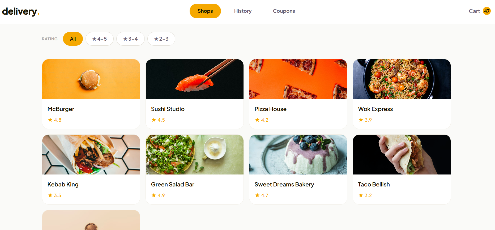
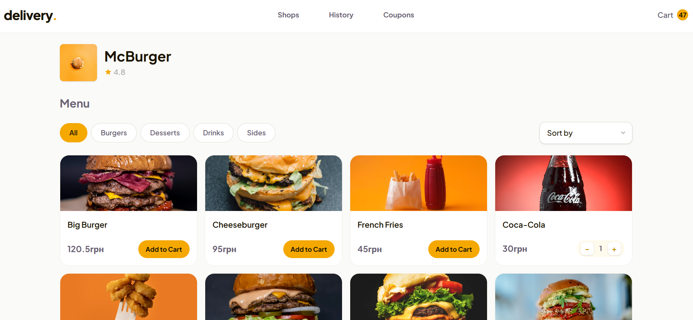
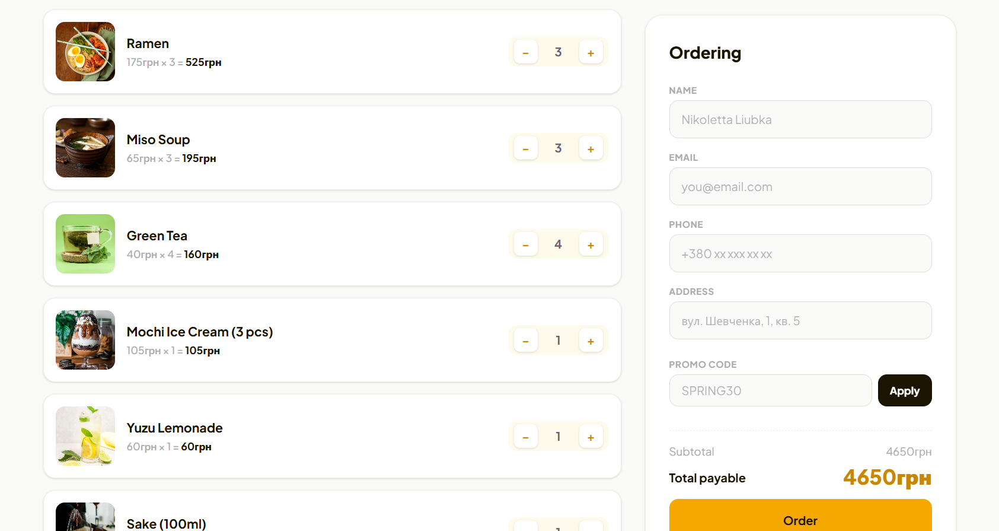
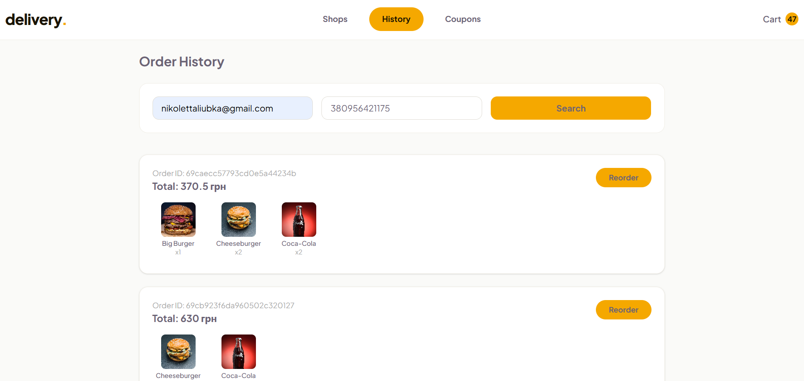
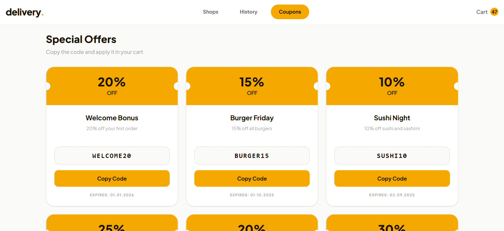

# Food Delivery App
Web application where users can order food delivery from various shops.
**Completed Level: Advanced** 
---
## Live Demo
[food-delivery.com](https://food-delivery-qcwz.onrender.com)

## Screenshots
- Shops page


- Products page


- Cart Page


- History


- Coupons


## Features

### Base Level 
- **Shops Page** — browse available shops and their products; add items to cart
- **Shopping Cart Page** — view/edit cart items, adjust quantities, remove products
- Checkout form with name, email, phone, and address fields
- Form validation before submission
- Orders saved to the database on submit

### Middle Level 
- **Responsive Design** — fully functional on desktop, tablet, and mobile
- **Product Filtering by Category** — filter products by Burgers, Drinks, Desserts, etc.
- **Product Sorting** — sort by price (asc/desc) or alphabetically (A → Z)
- **Shop Filtering by Rating** — filter shops by rating range (e.g. 4.0–5.0, 3.0–4.0)

### Advanced Level 
- **Pagination / Infinite Scroll** — products load in batches for better performance
- **Order History Page** — look up past orders by email, phone, or order ID
- **Reorder** — repeat any previous order with one click; items are added to the current cart

### Bonus Features 
- **Coupons Page** — browse available discount coupons; copy coupon code to clipboard
- Coupon codes can be applied on the Shopping Cart page for discounts

---

## Tech Stack

### Frontend
- **Technology**
- React
- TypeScript 
- React Router DOM 
- Axios
- Tailwind CSS 
- Vite 

### Backend
- **Technology**
- Node.js 
- Express 
- TypeScript 
- MongoDB + Mongoose 
- Hashids  

---

## Project Structure

```
├── client/               # React frontend (Vite + TypeScript)
│   ├── src/
│   │   ├── components/
│   │   ├── pages/
│   │   └── ...
│   └── package.json
│
└── server/               # Express backend (TypeScript + MongoDB)
    ├── src/
    │   ├── routes/
    │   ├── models/
    │   └── index.ts
    └── package.json
```

---

## Getting Started

### Prerequisites
- Node.js 18+
- MongoDB instance (local or Atlas)

### Installation

```bash
# Clone the repository
git clone https://github.com/Liubka-Nikoletta/food-delivery.git
cd food-delivery
```

**Backend:**
```bash
cd server
npm install
```

Create a `.env` file in `/server`:
```env
PORT=5000
MONGODB_URI=your_mongodb_connection_string
HASH_SALT=your_hash_salt
```

```bash
npm run dev
```

**Frontend:**
```bash
cd client
npm install
npm run dev
```

The app will be available at `http://localhost:5173`.

### Production Build

```bash
# Backend
cd server && npm run build && npm start

# Frontend
cd client && npm run build
```

---

## API Endpoints

| Method | Endpoint | Description |
|---|---|---|
| GET | `/api/shops` | Get all shops (supports rating filter) |
| POST | `/api/products` | Get products for a shop (supports category filter & sorting) |
| POST | `/api/orders` | Create a new order |
| POST | `/api/orders/history` | Look up orders by email/phone or order ID |
| GET | `/api/coupons` | Get all coupons |
